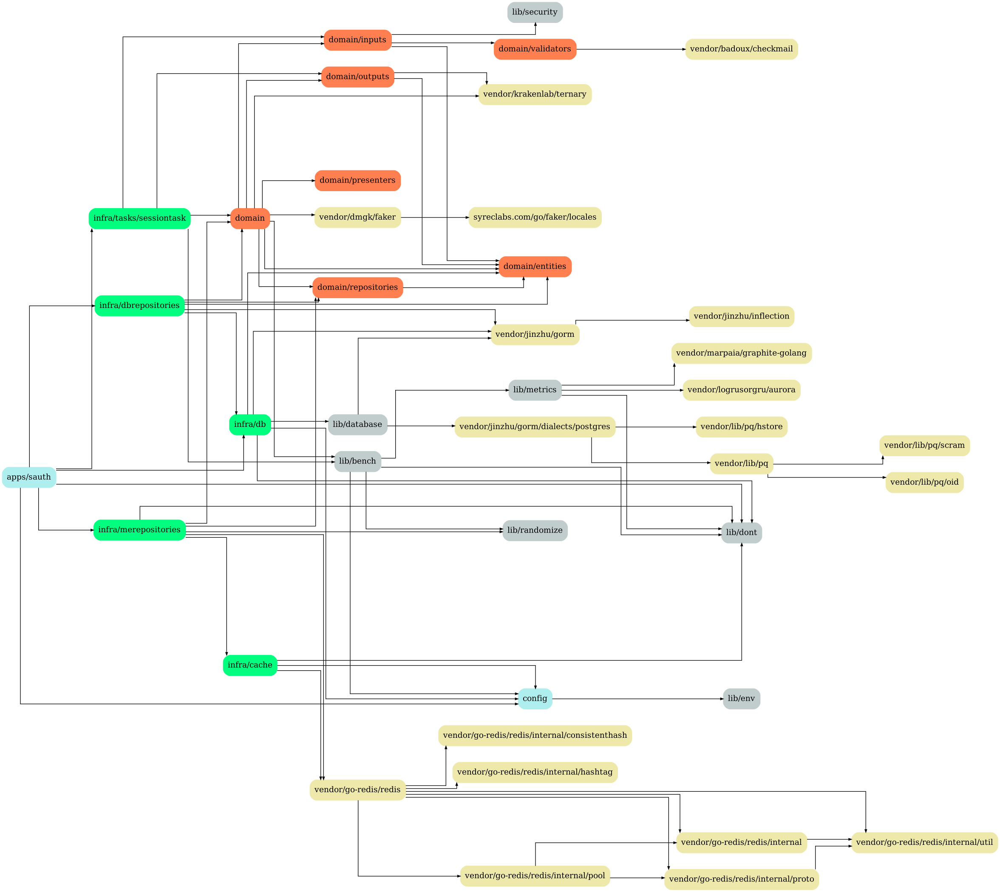
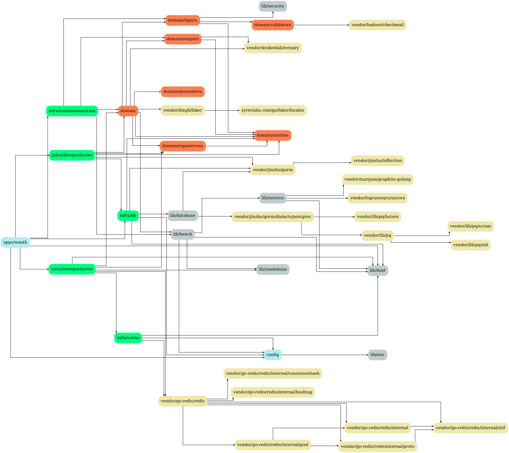

[](https://coveralls.io/github/schweigert/mmosandbox)
[](https://travis-ci.org/schweigert/mmosandbox)
[](https://hub.docker.com/r/schweigert/mmosandbox)

# mmosandbox
MMORPG Playground

## Deps

Setup:

```
    go get github.com/kisielk/godepgraph
    sudo pacman -S graphviz
```

```
    make deps
```

## Domain


## Services

### apps/sauth



### apps/sweb


### apps/sgame


### apps/wauth



### apps/wgame


### apps/wweb


## Clients

### clients/wclient


# Deploy

## beacon

Beacon send `docker stats` log to graphite server ¯\\_(ツ)_/¯:

```
NODE=node METRIC_HOST=localhost METRIC_PORT=2003 go run beacon/beacon.go
```

## Graphite / Grafana

```
    make ssh_graphite_grafana
```

```
    sudo apt-get update -y
    sudo apt-get install docker.io make binutils bison gcc -y

    sudo groupadd docker
    sudo usermod -aG docker $USER

    sudo curl -L "https://github.com/docker/compose/releases/download/1.24.1/docker-compose-$(uname -s)-$(uname -m)" -o /usr/local/bin/docker-compose

    sudo chmod +x /usr/local/bin/docker-compose

    bash < <(curl -s -S -L https://raw.githubusercontent.com/moovweb/gvm/master/binscripts/gvm-installer)

    gvm install go1.12 -B
    gvm use go1.12

    mkdir -p $GOPATH/src/github.com/schweigert
    cd $GOPATH/src/github.com/schweigert
    git clone https://github.com/schweigert/mmosandbox.git
    cd mmosandbox

    make install_beacon

    cd stacks/metrics/
    docker-compose up -d
    NODE=metrics_graphite_grafana METRIC_HOST=localhost METRIC_PORT=2003 beacon >> /dev/null &
```