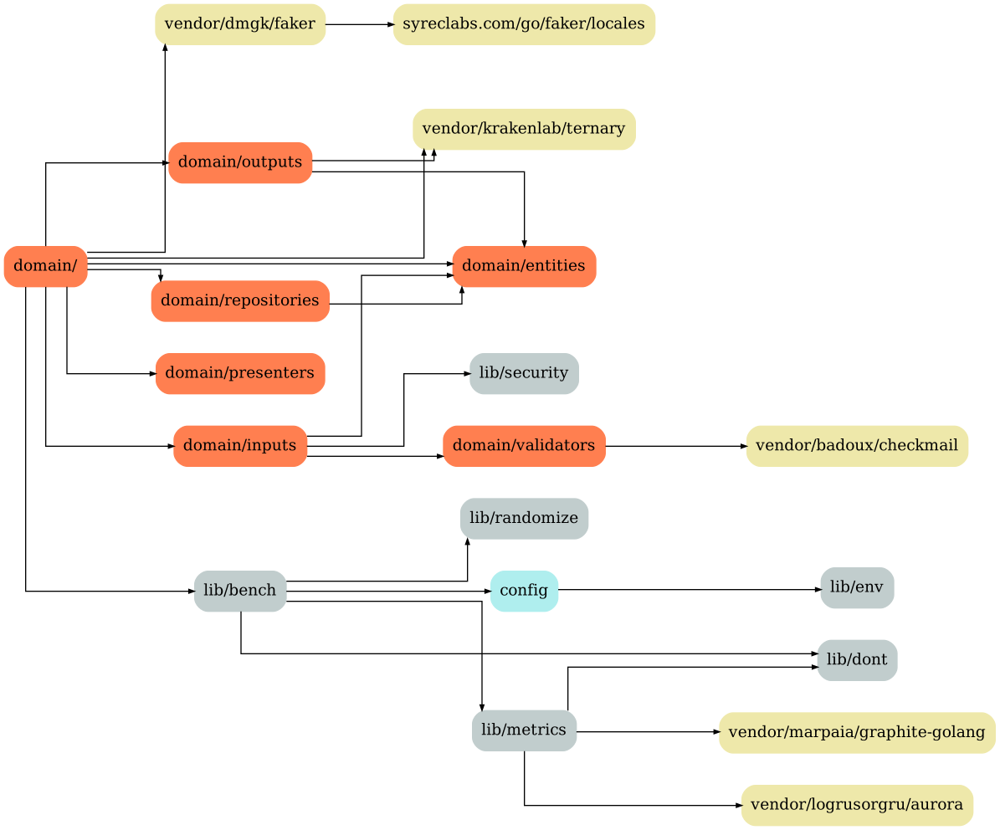
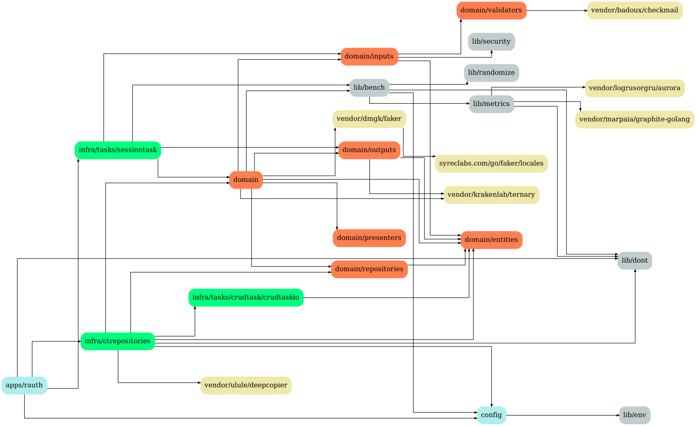
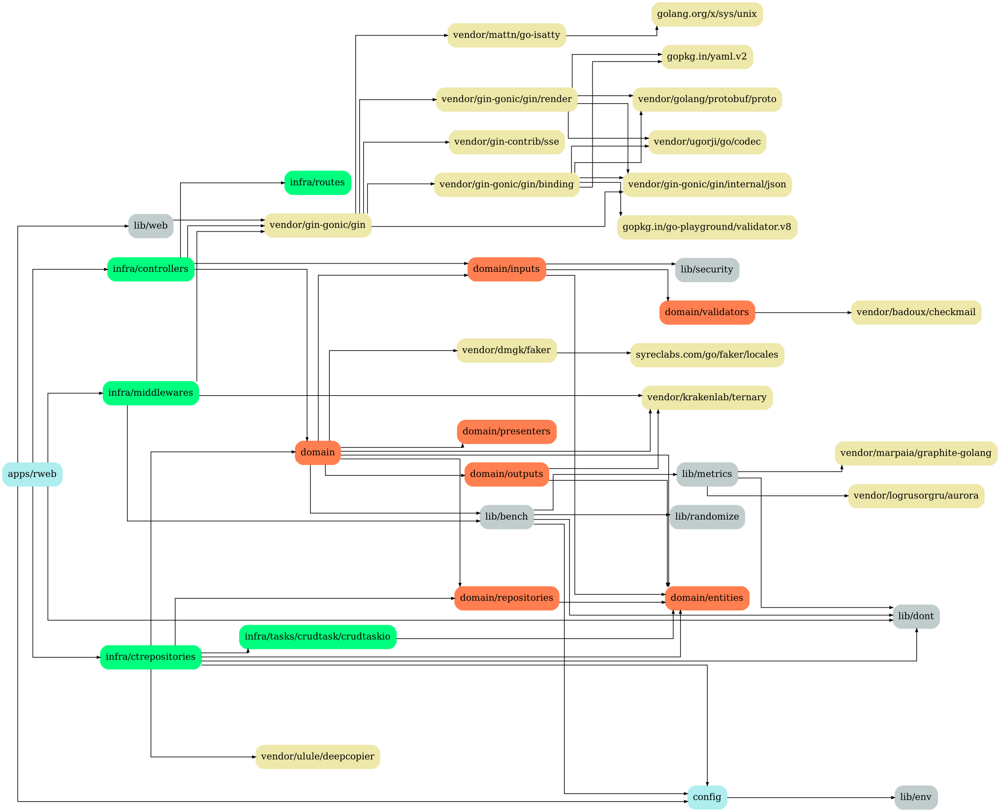
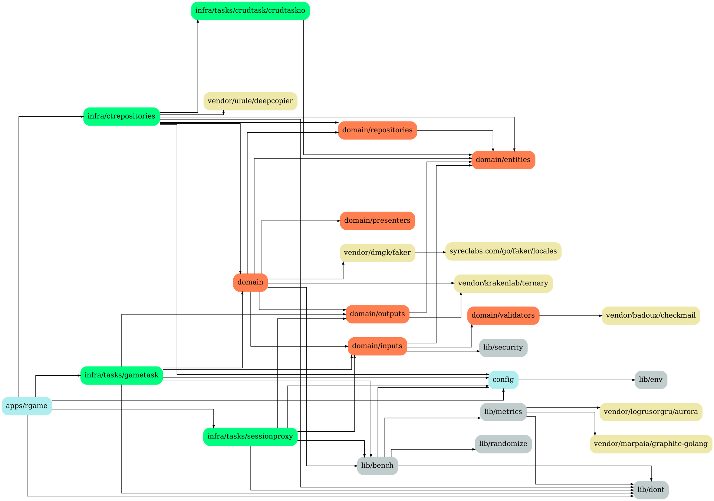
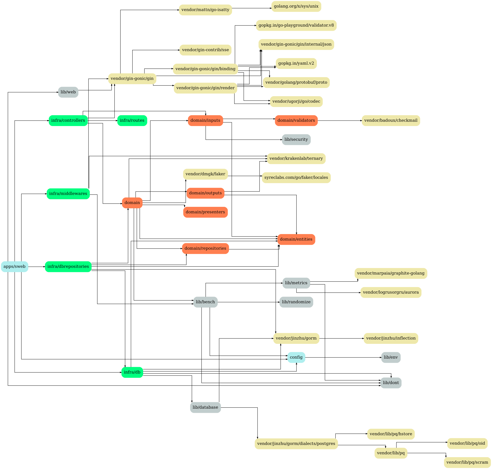
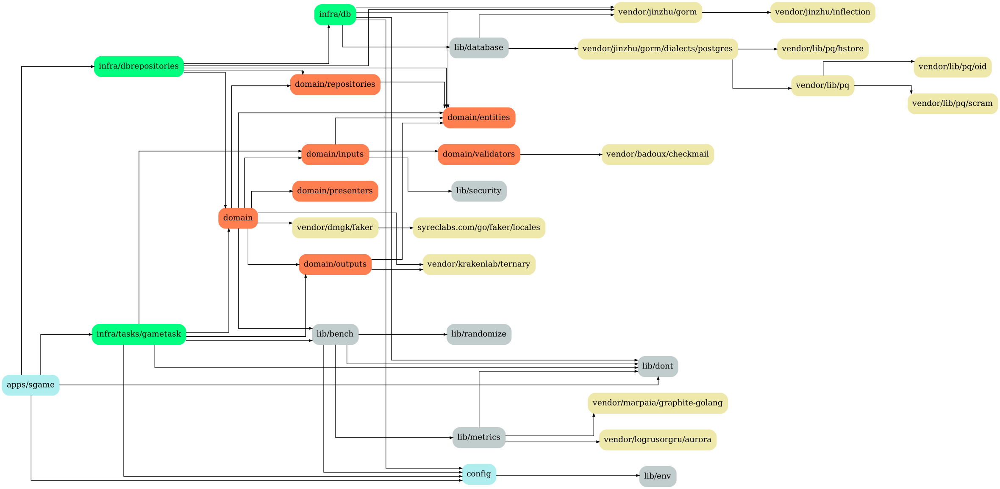
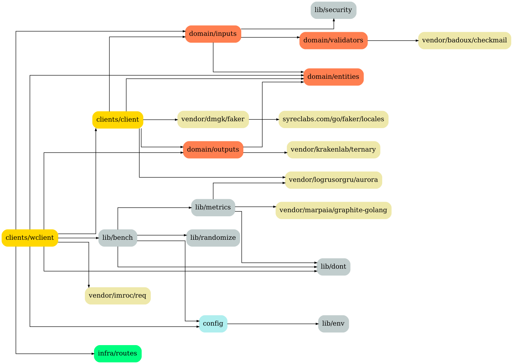

[](https://coveralls.io/github/schweigert/mmosandbox)
[](https://travis-ci.org/schweigert/mmosandbox)
[](https://hub.docker.com/r/schweigert/mmosandbox)

# mmosandbox
MMORPG Playground

## Deps

Setup:

```
    go get github.com/kisielk/godepgraph
    sudo pacman -S graphviz
```

```
    make deps
```

## Domain



## Services

### apps/rauth



### apps/rweb



### apps/rcrud


### apps/rgame



### apps/sauth


### apps/sweb



### apps/sgame



### apps/wauth


### apps/wgame


### apps/wweb


## Clients

### clients/wclient



# Deploy

## beacon

Beacon send `docker stats` log to graphite server ¯\\_(ツ)_/¯:

```
NODE=node METRIC_HOST=localhost METRIC_PORT=2003 go run beacon/beacon.go
```

## Graphite / Grafana

```
    make ssh_metrics
```

```
    sudo apt-get update -y
    sudo apt-get install docker.io make binutils bison gcc -y

    sudo groupadd docker
    sudo usermod -aG docker $USER

    sudo curl -L "https://github.com/docker/compose/releases/download/1.24.1/docker-compose-$(uname -s)-$(uname -m)" -o /usr/local/bin/docker-compose

    sudo chmod +x /usr/local/bin/docker-compose

    bash < <(curl -s -S -L https://raw.githubusercontent.com/moovweb/gvm/master/binscripts/gvm-installer)

    gvm install go1.12 -B
    gvm use go1.12

    mkdir -p $GOPATH/src/github.com/schweigert
    cd $GOPATH/src/github.com/schweigert
    git clone https://github.com/schweigert/mmosandbox.git
    cd mmosandbox

    make install_beacon

    cd stacks/databases/
    docker-compose up -d
    NODE=databases_postgres_redis METRIC_HOST=192.168.0.8 METRIC_PORT=2003 beacon >> /dev/null &
```

## Redis / Postgres

```
    make ssh_databases
```

```
    sudo apt-get update -y
    sudo apt-get install docker.io make binutils bison gcc -y

    sudo groupadd docker
    sudo usermod -aG docker $USER

    sudo curl -L "https://github.com/docker/compose/releases/download/1.24.1/docker-compose-$(uname -s)-$(uname -m)" -o /usr/local/bin/docker-compose

    sudo chmod +x /usr/local/bin/docker-compose

    bash < <(curl -s -S -L https://raw.githubusercontent.com/moovweb/gvm/master/binscripts/gvm-installer)

    gvm install go1.12 -B
    gvm use go1.12

    mkdir -p $GOPATH/src/github.com/schweigert
    cd $GOPATH/src/github.com/schweigert
    git clone https://github.com/schweigert/mmosandbox.git
    cd mmosandbox

    make install_beacon

    cd stacks/metrics/
    docker-compose up -d
    NODE=metrics_graphite_grafana METRIC_HOST=10.20.218.237 METRIC_PORT=2003 beacon >> /dev/null &
```

## GBeacon

```
sudo apt install gnupg2
gpg2 --recv-keys 409B6B1796C275462A1703113804BB82D39DC0E3 7D2BAF1CF37B13E2069D6956105BD0E739499BDB
curl -sSL https://get.rvm.io | bash -s stable
source /home/ubuntu/.rvm/scripts/rvm
sudo rm /etc/apt/source.list.d/webupd8team-ubuntu-java.bionic.list
rvm install 2.6.3
gem install gbeacon
gbeacon.rb --graphite "10.20.218.237:2003" --prefix "client_00x" > /dev/null &
NODE=client_00x METRIC_HOST=10.20.218.237 METRIC_PORT=2003 beacon > /dev/null &
```

## Swarm Clients

```
sudo docker swarm leave --force
sudo docker swarm join --token SWMTKN-1-2c0gk93fau3hfrdvlfiv27t7gb5rv1hkr9522owl0cbqd47yax-2n30d06ikryu0ag86jmrxzf4l 192.168.4.215:2377
```
