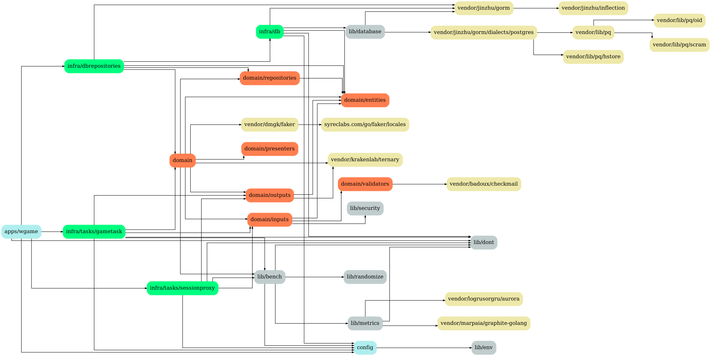
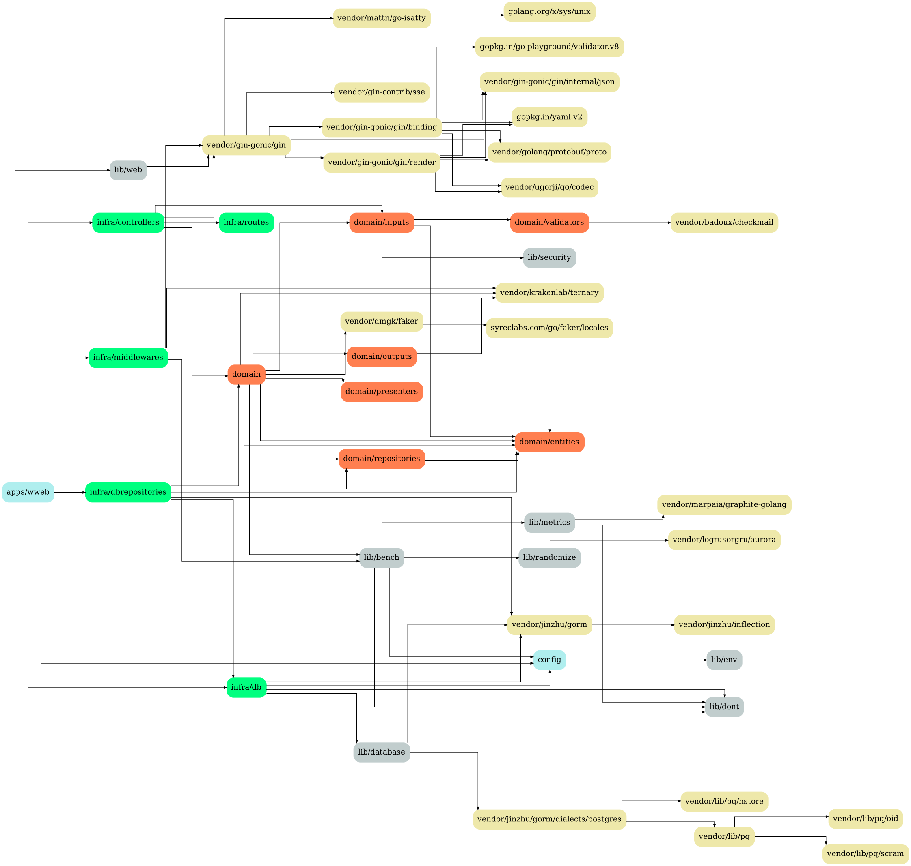

# mmosandbox
MMORPG Playground

## Dev

## Deps

Setup:

```
    go get github.com/kisielk/godepgraph
    sudo pacman -S graphviz
```

```
    make deps
```

## TODO

 - [x] Criar regra de negócio para criar conta
 - [x] Criar cliente para criar conta na arq Willson
 - [ ] Criar cliente para criar conta na arq Salz
 - [ ] Criar cliente para criar conta na arq Rudy
 - [ ] Criar Regra de negócio para criar personagem
 - [ ] Criar cliente para criar personagem na arq Willson
 - [ ] Criar cliente para criar personagem na arq Salz
 - [ ] Criar cliente para criar personagem na arq Rudy

## Domain


## Services

### apps/wauth


### apps/wgame



### apps/wweb



## Clients

### clients/wclient

